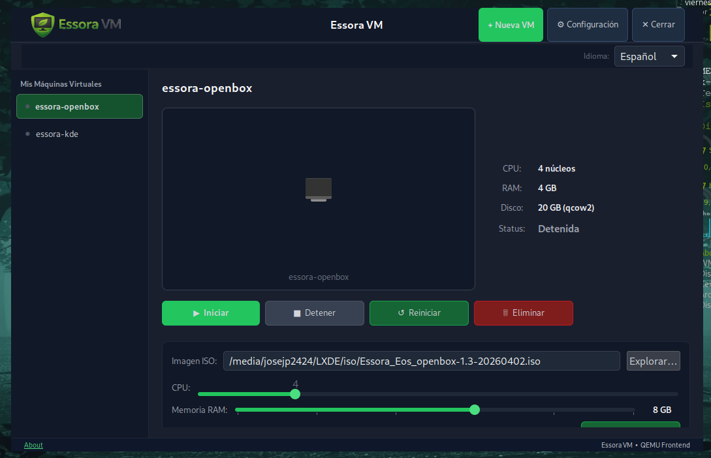
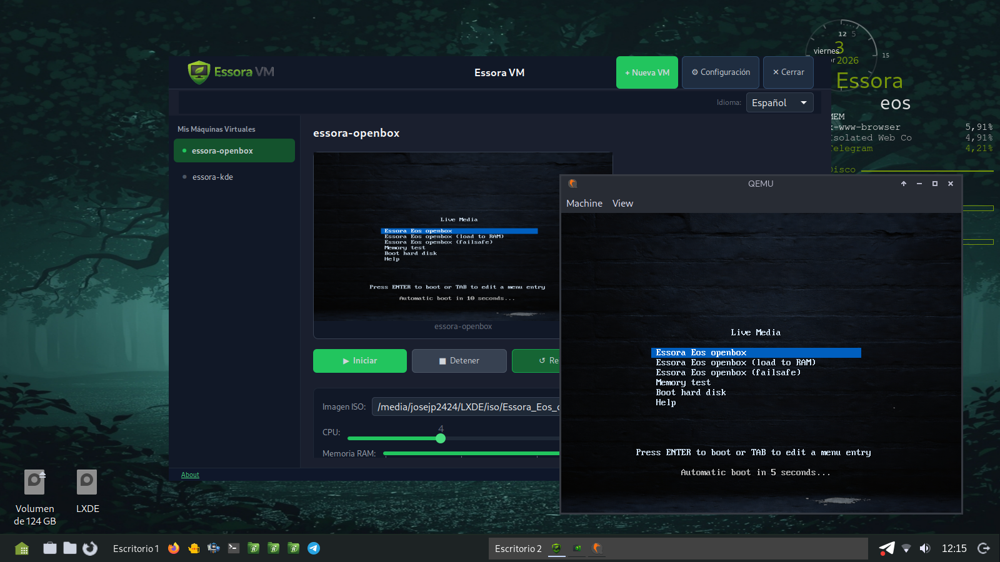

# Essora VM

<p align="center">
  
</p>

Lightweight QEMU virtual machine manager for Essora Linux, built with Python3 and GTK3.
Create and manage virtual machines with KVM support, ISO boot, live screen preview and a clean dark interface. Available in 12 languages.

---

## Features

- Create and manage multiple virtual machines
- KVM hardware acceleration with one-click toggle
- Live screen preview via QEMU monitor socket
- ISO image selection for OS installation
- CPU and RAM sliders with real-time values
- Disk images created automatically in qcow2 format
- Clean dark interface with Essora branding
- No system titlebar, centered window
- Multilingual: English, Spanish, Arabic, Catalan, German, French, Italian, Portuguese, Japanese, Hungarian, Russian and Chinese

---

## Requirements

- Essora Linux / Devuan (amd64)
- Python 3.8 or higher
- GTK 3.0
- QEMU

---

## Installation

### From .deb package (recommended)

Download the latest release:

```
essora-vm_1.2-essora_amd64.deb
```

Install from terminal:

```bash
sudo dpkg -i essora-vm_1.2-essora_amd64.deb
sudo apt-get install -f
```

The second command resolves any missing dependencies automatically.

### Dependencies installed automatically

- python3-gi
- python3-gi-cairo
- gir1.2-gtk-3.0
- gir1.2-gdkpixbuf-2.0
- qemu-system-x86
- qemu-utils
- xdotool

---

## Usage

Launch from the application menu or run from terminal:

```bash
essora-vm
```

To run a specific ISO directly:

```bash
essora-vm /path/to/image.iso
```

---

## Screenshots

<p align="center">
  
</p>

---

## License

This project is licensed under the GNU General Public License v3.0.
See the [LICENSE](LICENSE) file for details.

---

## Author

**josejp2424**
Essora Developer — Essora Linux

GitHub: [https://github.com/josejp2424/essora-vm](https://github.com/josejp2424/essora-vm)
